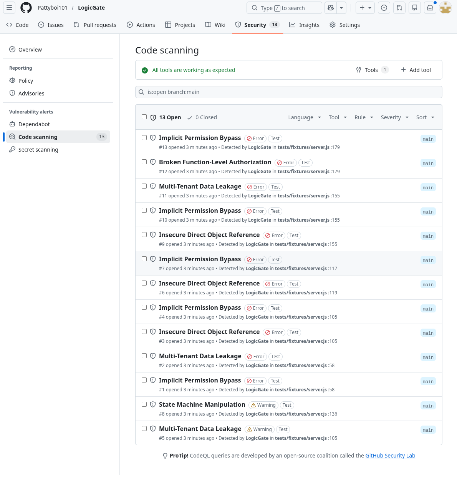

# LogicGate

**AI-native business logic vulnerability scanner for JavaScript/TypeScript.**

Finds the bugs that Snyk, Semgrep, and CodeQL miss: IDOR, broken authorization, state machine manipulation, and implicit permission bypasses — the vulnerabilities that live in your application's *logic*, not its syntax.



---

## What makes this different

Traditional SAST tools pattern-match against known vulnerability signatures. They catch SQL injection and XSS. They **cannot** catch:

- A booking endpoint that lets any user delete any other user's booking (IDOR)
- An admin panel served without authentication middleware (BFLA)
- A status field that allows `cancelled` → `confirmed` transitions (State Machine Manipulation)

LogicGate catches all three. It combines **tree-sitter** static parsing with **call-graph slicing** and **Claude Opus 4.6** semantic reasoning to understand what your code *does*, not just what it *looks like*.

## How it works

```
Source Files → [Parse] → [Build Graph] → [Audit via Claude] → [SARIF Report]
```

1. **Parse** — Tree-sitter extracts every Express route, function definition, import, and call site from your JS/TS codebase
2. **Build Graph** — NetworkX constructs a directed dependency graph. Nodes are functions, edges are call relationships
3. **Slice & Audit** — For each route, LogicGate extracts the full call chain (depth-limited BFS) and sends it to Claude with a specialized security prompt targeting 5 vulnerability categories
4. **Report** — Outputs SARIF 2.1.0 that plugs directly into GitHub Advanced Security, VS Code, and Azure DevOps

### Auto-Remediation

LogicGate doesn't just find bugs — it **writes the fix**. Pass `--remediate` and it generates unified diff patches for each finding, ready to apply with `git apply`.

## Install

```bash
git clone https://github.com/Pattyboi101/LogicGate.git
cd LogicGate
pip install poetry
poetry install
```

## Usage

### Scan a codebase

```bash
export ANTHROPIC_API_KEY=your-key
poetry run logicgate /path/to/project -v
```

### Scan with auto-remediation

```bash
poetry run logicgate /path/to/project --remediate -v
# Patches written to logicgate-fixes/
git apply logicgate-fixes/IDOR_in_booking_105.patch
```

### Options

| Flag | Description | Default |
|------|-------------|---------|
| `--api-key` | Anthropic API key (or set `ANTHROPIC_API_KEY`) | required |
| `--output`, `-o` | SARIF output path | `logicgate-report.sarif.json` |
| `--depth`, `-d` | Call graph slice depth | `5` |
| `--model`, `-m` | Claude model | `claude-opus-4-6` |
| `--verbose`, `-v` | Show findings in real time | `false` |
| `--remediate` | Generate code fix patches | `false` |

## What it detects

| Rule | Category | What it catches |
|------|----------|----------------|
| LG001 | **IDOR** | Resource accessed by user-supplied ID without ownership verification |
| LG002 | **BFLA** | Privileged action exposed without role or permission checks |
| LG003 | **State Machine Manipulation** | Entity state transitions that skip or bypass validation |
| LG004 | **Multi-Tenant Data Leakage** | Queries that don't scope results to the requesting tenant |
| LG005 | **Implicit Permission Bypass** | Authorization assumed but never enforced in code |

## CI/CD Integration

LogicGate includes a GitHub Actions workflow. Add `ANTHROPIC_API_KEY` as a repository secret and findings appear as code scanning alerts on every push and PR.

```yaml
# .github/workflows/logicgate-scan.yml (already included)
- name: Run LogicGate
  run: poetry run logicgate . --output results.sarif
  env:
    ANTHROPIC_API_KEY: ${{ secrets.ANTHROPIC_API_KEY }}

- name: Upload SARIF
  uses: github/codeql-action/upload-sarif@v3
  with:
    sarif_file: results.sarif
```

Exit code `1` when critical/high findings exist — blocks merges automatically.

## Architecture

```
logicgate/
  models.py       # Pydantic data models (RouteInfo, Finding, AuditResult, Remediation)
  parser.py        # Tree-sitter parser with pre-compiled .scm queries
  graph.py         # NetworkX dependency graph with BFS slicing
  analyzer.py      # Claude API integration for vulnerability detection
  remediator.py    # Claude API integration for code fix generation
  reporter.py      # SARIF 2.1.0 output with fixes support
  cli.py           # Typer CLI with Rich progress display
  queries/         # Tree-sitter S-expression patterns
    express_routes.scm
    function_defs.scm
    function_calls.scm
    require_imports.scm
```

## Tests

```bash
poetry run pytest tests/ -v
# 50 tests, covering parser, graph, reporter, and remediator
```

## License

MIT
